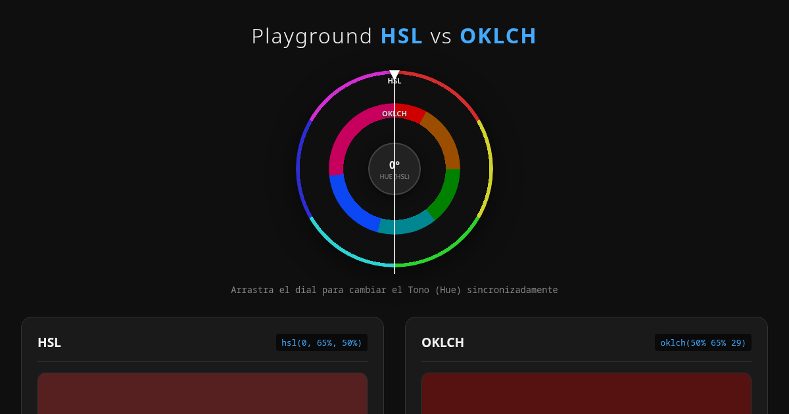

# 🎨 Color Compass: LCH vs HSL Playground

An interactive, visual, and educational tool designed to help developers and designers understand the differences between the traditional HSL color model and the modern, perceptually uniform OKLCH color space.

If you've ever been confused by why a 50% lightness in HSL looks completely different depending on the hue, or why the oklch() hue angles seem "rotated" compared to HSL, this tool is for you.



**Live:** https://senseikatana.com/hueplay/

## 🚀 Features

* Interactive 360° Dial: A draggable dial that synchronizes the Hue for both HSL and OKLCH simultaneously.
* Dual Color Rings: The dial features two concentric rings. The outer ring shows the perfect 60° divisions of HSL, while the inner ring shows the physically accurate, deformed divisions of OKLCH.
* Independent Sliders: Separate controls for Lightness and Saturation (HSL) / Chroma (OKLCH) in both panels — plus one synchronized Hue slider per panel — so you can see how the same numeric values produce different visual results.
* Dynamic Slider Tracks: the two Hue sliders carry a live gradient track (a full sRGB hue wheel on the HSL side, a full OKLCH hue wheel on the OKLCH side) that acts as a mini color-picker while you drag.
* Real-time CSS Code Output: Instantly generates the exact hsl() and oklch() CSS strings, ready to copy to your clipboard.
* Zero runtime dependencies: pure HTML, CSS, and Vanilla JavaScript — no frameworks, no bundler. The only script is a copy step for deployment.

## 🧠 The Core Concept: Why OKLCH?

HSL (Hue, Saturation, Lightness) was designed to be easy for humans to understand. However, it is mathematically flawed when it comes to how screens emit light and how our eyes perceive it.

- HSL is not perceptually uniform: A Yellow at 50% Lightness appears blindingly bright to the human eye, while a Blue at 50% Lightness appears quite dark.
- OKLCH is perceptually uniform: If you set an OKLCH Lightness to 60%, a Red, a Green, and a Blue will all visually appear to have the exact same brightness. This makes creating balanced color palettes and accessible UI components infinitely easier.
- The Hue Shift: Because OKLCH maps to human vision rather than screen RGB primaries, the color wheel is rotated and unevenly stretched. Pure red in HSL is 0°, but in OKLCH it is ~29°, while yellow moves from 60° to ~110° — the shift is different at every hue.

---

## 🧪 The "Aha!" Experiment

To see the power of OKLCH in action, try this in the playground:

1. In the HSL panel set Hue to 49°, Saturation to 100% and Lightness to 50% (`#ffd000`, a golden yellow).
2. In the OKLCH panel set Lightness to 50% and Chroma to 100%. Its Hue already reads **92°** — the real sRGB→OKLCH equivalent, derived from the color you just built.
3. Look at the large color displays. Notice how HSL yellow is blindingly bright, while OKLCH yellow is balanced.
4. Now, drop the Lightness to 20% in both panels.
5. Notice how the HSL yellow becomes a dark olive/brown, while the OKLCH yellow gracefully darkens into a rich, recognizable gold.

---

## 📐 Why Your Hex and `hsl()` Values Don't Match `oklch()`

This is the section to read if you have ever pasted `#ff0000` (or `hsl(0, 100%, 50%)`) into a converter, got `oklch(62.8% 64.4% 29.2)` back, and wondered where those numbers came from. Two separate things are going on: the two models are different coordinate systems, and the conversion path is nonlinear. The playground itself converts exactly — section 6 explains what that does and does not guarantee.

### 1. Different coordinate systems — not different colors

- `#rrggbb`, `rgb()` and `hsl()` are all **sRGB** coordinates. They are *gamma-encoded* (the stored numbers are not proportional to emitted light, the sRGB transfer function approximates a ~2.2 gamma) and they are **not perceptually uniform**: `hsl(60, 100%, 50%)` yellow looks blindingly bright while `hsl(240, 100%, 50%)` blue looks dark, even though both say "50% lightness".
- `oklch()` is the polar form of **OKLab**, a space Björn Ottosson derived from human cone (LMS) responses so that equal numeric steps *feel* equal. It is a different coordinate system for the same physical colors, so there is no one-to-one numeric correspondence: `60` in HSL means nothing in OKLCH, and `0.15` chroma does not mean "15% saturated".
- Even the "equivalent hue" of an HSL hue is not a single fixed number, because OKLCH hue is computed from the whole color, not from the HSL hue angle alone. HSL blue `#0000ff` converts to OKLCH hue **264.1°**, but `hsl(240, 50%, 50%)` converts to **275.6°** and `hsl(240, 25%, 50%)` to **282.4°**.
- The same applies to CIE `lch()`: sRGB green sits at **142.5°** in OKLCH but at **134.4°** in CIE LCH. "The equivalent hue" always depends on which space you are converting into.

### 2. The path is not linear

Getting from a hex value to OKLCH means walking through several steps, two of which are nonlinear:

```text
hex / hsl()                       sRGB, gamma-encoded 8-bit coordinates
  → linearize                     sRGB EOTF: linear below 0.04045 (slope 12.92),
                                  otherwise ((c + 0.055) / 1.055)^2.4  →  overall gamma ≈ 2.2
  → XYZ (D65)                     matrix on linear-light RGB (sRGB primaries, D65 white point)
  → OKLab                         matrix to cone (LMS) responses, then a CUBE ROOT, then a matrix
  → OKLCH                         polar form: C = √(a² + b²), H = atan2(b, a)
```

Because both the transfer function and the cube root bend the numbers, the color wheel is **rotated *and* stretched non-uniformly**. The true conversion of the six HSL anchors:

| HSL anchor | HSL hue | True OKLCH hue | Rotation |
|---|---|---|---|
| Red | 0° | 29.2° | +29.2° |
| Yellow | 60° | 109.8° | +49.8° |
| Green | 120° | 142.5° | +22.5° |
| Cyan | 180° | 194.8° | +14.8° |
| Blue | 240° | 264.1° | +24.1° |
| Magenta | 300° | 328.4° | +28.4° |

The shift is not constant, so the sectors are not constant either: the 60° HSL sector from red to yellow spans **80.6°** of OKLCH hue (stretched ~1.34×), while the 60° sector from yellow to green spans only **32.7°** (compressed ~0.55×). It is a different wheel, not the same wheel seen from another angle.

### 3. Worked example: what a converter says vs. what this tool says

Fully saturated HSL colors (`s = 100%`, `l = 50%`), converted with the standard sRGB → OKLCH formula and rounded to one decimal:

| CSS input | Hex | True `oklch()` equivalent | This tool shows | Difference |
|---|---|---|---|---|
| `hsl(0, 100%, 50%)` | `#ff0000` | `oklch(62.8% 64.4% 29.2)` | 29° | −0.2° |
| `hsl(49, 100%, 50%)` | `#ffd000` | `oklch(87.3% 44.7% 92.3)` | 92° | −0.3° |
| `hsl(60, 100%, 50%)` | `#ffff00` | `oklch(96.8% 52.8% 109.8)` | 110° | +0.2° |
| `hsl(120, 100%, 50%)` | `#00ff00` | `oklch(86.6% 73.7% 142.5)` | 142° | −0.5° |
| `hsl(180, 100%, 50%)` | `#00ffff` | `oklch(90.5% 38.6% 194.8)` | 195° | +0.2° |
| `hsl(240, 100%, 50%)` | `#0000ff` | `oklch(45.2% 78.3% 264.1)` | 264° | −0.1° |
| `hsl(300, 100%, 50%)` | `#ff00ff` | `oklch(70.2% 80.6% 328.4)` | 328° | −0.4° |

So: the playground agrees with a real conversion everywhere, to within half a degree — the only difference left is the whole-degree rounding of the slider.

### 4. Chroma: a percentage is not the same number

CSS Color 4 allows chroma in `oklch()` to be written as a number **or** a percentage, and the percentage has its own reference range: **`100%` chroma = `0.4`**, not `1.0`. Therefore:

```css
oklch(60% 0.15 29)   /* chroma = 0.15 */
oklch(60% 15% 29)    /* chroma = 0.06  (15% of 0.4) — NOT 0.15 */
```

Lightness does not have this trap (`100%` L = `1.0`, so `65%` and `0.65` agree); chroma — and the a/b axes of `oklab()` — use the 0.4 reference.

This tool always emits chroma as a **percentage**: the code string is built as `oklch(<lightness>% <chroma>% <hue>)`, so the default panel output is `oklch(50% 65% 29)`, which resolves to absolute chroma **0.26**. If you re-type that as `0.65` because "65% looked like 0.65", you get a color **2.5× more chromatic** than the swatch on screen. When the browser computes the style it converts the percentage to a number for you — never do that conversion by eye.

### 5. Gamut: what you specify is not always what you see

Every sRGB color has one exact OKLCH triple — the conversion itself is reversible. The problem is the other direction: many `oklch()` triples have **no sRGB representation at all**. sRGB tops out around chroma **0.32** (≈80% on the percentage scale, near magenta), and at `l = 50%` the ceiling is much lower — about 0.09 for cyan and 0.28 for blue.

Consequences you will run into with this tool:

* The chroma slider goes to `100%` (= `0.4`), which is out of the sRGB gamut for **every** hue. Even the default `oklch(50% 65% 29)` (chroma 0.26) exceeds the ≈0.21 available at that lightness for red.
* CSS keeps the out-of-gamut value as the computed value, but when the browser rasterizes it onto an sRGB canvas it maps the color back into sRGB — CSS Color 4 specifies a chroma-reduction algorithm for that (older engines may simply clip). The pixel you see therefore has **lower chroma than the number you wrote**.
* Round-tripping through a screenshot, a color picker, or a DevTools copy gives you a *different* triple than you started with — that is gamut mapping, not a conversion bug.

### 6. What this tool actually does

`color.js` runs the full conversion described in section 2 — sRGB transfer
function, OKLab, then the polar transform — so the hue printed by the
playground **is** the real one. Nothing is interpolated from a table; the only
loss is the whole-degree rounding the slider forces.

Two things it still cannot promise:

* **Round trips through the gamut are lossy.** Section 5 applies: the browser
  maps an out-of-gamut `oklch()` back onto sRGB before you see it, so copying
  the pixel out of DevTools gives you a different triple than you typed.
* **The hue is a property of the whole color, not of the hue angle.** The
  playground therefore re-derives the OKLCH hue every time you move the HSL
  saturation or lightness. A hex value you picked months ago carries its own
  saturation and lightness, so its OKLCH hue is whatever *that* color gives —
  which is exactly why a converter never returns a single "translation table"
  you can reuse.

When you need exact values for design tokens, shared palettes or accessibility
math, still prefer a color-managed source of truth:

* the browser's DevTools color picker — it can display any color in OKLCH notation;
* `color-mix(in oklch, …)` — let the browser do the conversion and read the result in DevTools;
* a color library such as [culori](https://culorijs.org) or [colorjs.io](https://colorjs.io).

---

## 🛠️ How to Use

No installation required to try it — just open `index.html` in your browser.

For development and deployment you only need [Bun](https://bun.sh):

```bash
git clone https://github.com/senseikatana/senseikatana.git
cd senseikatana/colour-wheel-playground
bun install
```

| Command | What it does |
|---|---|
| `bun run dev` | Local server via `wrangler dev` at `http://localhost:8787` |
| `bun run build` | Copies the static files into `dist/` |
| `bun run deploy` | Builds and deploys to Cloudflare Workers |

---

## ☁️ Deployment

The site is served by a **Cloudflare Worker with Static Assets** (not GitHub Pages, not Cloudflare Pages) mounted on the `/hueplay/*` path of the apex domain.

`wrangler.jsonc` points `custom_domain` at `senseikatana.com` and `www.senseikatana.com`. Cloudflare provisions the DNS records (A + AAAA) and the TLS certificate automatically, so no manual DNS setup is needed.

`worker.js` is the edge router: it strips the `/hueplay` prefix and fetches the asset, redirects the domain root into the playground, rejects anything that is not `GET`/`HEAD`, rebuilds the asset path instead of slicing it (so `//host` and `..` cannot reach the binding) and sets the security and cache headers on every response. Unknown routes return a real **404** — there is no client-side routing, so `wrangler.jsonc` does not enable the SPA fallback.

```
senseikatana.com/                 -> 302 /hueplay/
senseikatana.com/hueplay          -> 301 /hueplay/
senseikatana.com/hueplay/*        -> asset (or 404)
```

Headers sent with every response: `Content-Security-Policy` (only
`frame-ancestors`/`base-uri`/`form-action`, deliberately leaving `script-src`
alone so it cannot interfere with the challenge scripts Cloudflare injects when
JavaScript Detections is enabled), `X-Frame-Options: DENY`,
`X-Content-Type-Options: nosniff`, `Referrer-Policy`,
`Permissions-Policy`, `Strict-Transport-Security` and `Cache-Control: no-cache`
(the asset names carry no fingerprint, so revalidation is the honest policy).

> **Note:** use the local `wrangler` from `node_modules` (`bun run deploy`). A globally installed `wrangler` in this environment ships a broken `workerd` symlink and fails with `ERR_RUNTIME_FAILURE`.

---

## ⚙️ The Math: How the Hue Is Mapped

HSL and OKLCH do not share a hue axis, so dragging the dial cannot simply copy
the number across. Rather than interpolating a table, the playground converts
the actual color described by the HSL panel:

```js
// color.js
hslHueToOklchHue(h, s, l) // hsl -> sRGB -> linearize -> OKLab -> atan2(b, a)
oklchHueToHslHue(targetH, s, l, preferH) // inverse, keeping the dial continuous
```

Three consequences worth knowing:

* **The equivalence depends on saturation and lightness, not on the hue angle
  alone.** `hsl(240, 100%, 50%)` is **264°** in OKLCH while
  `hsl(240, 30%, 40%)` is **281°** — 17° apart at the same HSL hue. That is why
  the OKLCH hue re-derives whenever you move the HSL saturation or lightness.
* **The inverse is not unique near the primaries.** Around blue, a 10-15° span
  of HSL hue collapses into a single degree of OKLCH hue, so dragging the OKLCH
  hue slider moves the HSL hue in visible steps there. That is the shape of the
  color space, not a rounding bug.
* **Whole degrees.** Hue sliders are integers, so the readout is the true value
  rounded. Going HSL → OKLCH → HSL still returns the hue you started with,
  because the current hue is recognised before the inverse search runs.

The inner ring does not use the mapping at all: it paints the six HSL primaries
at their *true* OKLCH hues (29.2°, 109.8°, 142.5°, 194.8°, 264.1°, 328.4°), so
its sectors are visibly uneven. That deformation is the whole point of the
second ring.

---

## 🧩 Tech Stack

* **HTML5:** semantic structure and native range inputs.
* **CSS3:** `conic-gradient` for the color wheels, `mask-image` for ring shaping, `linear-gradient` for dynamic slider tracks.
* **Vanilla JS:** `color.js` for the sRGB ↔ OKLCH math, `index.js` for the DOM, pointer events and rendering.
* **Cloudflare Workers:** edge routing and static asset serving for the `/hueplay/*` mount point.

## 📄 License

This project is open source and available under the MIT License.

